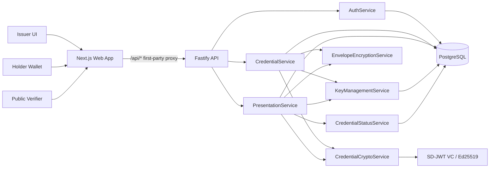

# RevealID

[](https://github.com/SomneelSaha2042/RevealID/actions/workflows/ci.yml)


RevealID is a privacy-preserving academic credential wallet and verifier. It lets an issuer create signed academic credentials, lets a holder disclose only selected claims, and lets a public verifier validate the presentation without seeing hidden fields such as CGPA, marks, or student identifiers.

The project is built as a public portfolio-grade vertical slice through verified Gate 4: issuer issuance, holder wallet, selective sharing, public verification, revocation, audit-safe verification events, and OpenAPI documentation.

## Highlights

- RFC 9901-style SD-JWT selective disclosure with mandatory holder key binding for public presentations.
- Ed25519 issuer signing and holder-bound presentations through explicit crypto service boundaries.
- Fastify API with Swagger/OpenAPI at `/docs`.
- Next.js wallet, issuer, and verifier flows with first-party cookie auth.
- PostgreSQL persistence through Prisma, with encrypted credentials and presentations at rest.
- Share links backed by SHA-256 token hashes only; raw tokens are never stored.
- Privacy regression tests proving hidden claims do not appear in serialized presentations or verifier responses.
- Gate 4 verified with CI coverage for lint, strict typecheck, unit/integration tests, and production builds.

## Architecture



Route handlers do not call cryptographic libraries directly. Credential issuance, presentation creation, verification, key handling, envelope encryption, and revocation checks stay behind dedicated services.

More detail: [docs/architecture.md](docs/architecture.md).

## Tech Stack

- Monorepo: pnpm workspaces
- Web: Next.js 16, React 19
- API: Fastify 5, Zod, Swagger UI
- Database: PostgreSQL, Prisma
- Crypto: `@sd-jwt/core`, `@sd-jwt/sd-jwt-vc`, `@sd-jwt/crypto-nodejs`, `jose`
- Tests: Vitest, jsdom
- CI: GitHub Actions

## Quick Start

Prerequisites:

- Node.js 22
- pnpm 9.12.0 through Corepack
- Docker Desktop or another PostgreSQL 16 instance

1. Copy the environment template.

```bash
cp .env.example .env
```

2. Start PostgreSQL.

```bash
docker compose up -d postgres
```

3. Install dependencies and prepare the database.

```bash
pnpm install
pnpm db:generate
pnpm db:migrate
pnpm db:seed
```

4. Run the API and web app.

```bash
pnpm dev
```

Open:

- Web app: `http://localhost:3000`
- API health: `http://localhost:4000/health`
- Swagger/OpenAPI: `http://localhost:4000/docs`

## Live Demo

- Production web app: [https://revealidweb-production.up.railway.app/](https://revealidweb-production.up.railway.app/)
- Production API: [https://revealidapi-production.up.railway.app/](https://revealidapi-production.up.railway.app/)
- Production Swagger/OpenAPI: [https://revealidapi-production.up.railway.app/docs](https://revealidapi-production.up.railway.app/docs)
- Production API health: [https://revealidapi-production.up.railway.app/health](https://revealidapi-production.up.railway.app/health)

Smoke checks passed against the Railway production deployment on May 30, 2026: web root, API health, web `/api/health` proxy, and Swagger UI all returned `200 OK`.

## Demo Accounts

The seed command creates two evaluator-friendly accounts:

| Role | Email | Password |
| --- | --- | --- |
| Issuer | `issuer@demo-university.edu` | `DemoIssuerPass123!` |
| Holder | `holder@example.edu` | `DemoHolderPass123!` |

## 5-Minute Demo Script

1. Sign in as the issuer.
2. Issue an academic credential to `holder@example.edu` with degree, graduation year, CGPA, and marks.
3. Sign out, then sign in as the holder.
4. Open the wallet, select the credential, and create a share link disclosing only `degree` and `graduationYear`.
5. Open the verifier link in a separate browser session.
6. Confirm the verifier shows a valid result and never renders CGPA, marks, or hidden claim names.
7. Return as issuer, revoke the credential, then verify that the old share no longer validates.

Recording-ready script: [docs/demo-script.md](docs/demo-script.md).

## API Surface

Swagger UI is available at `/docs` when the API is running. Key routes include:

| Area | Endpoint | Purpose |
| --- | --- | --- |
| Auth | `POST /auth/register` | Create holder account |
| Auth | `POST /auth/login` | Start cookie-based session |
| Auth | `GET /me` | Read current authenticated user |
| Issuer | `POST /credentials/issue` | Issue an SD-JWT academic credential |
| Issuer | `GET /issuer/credentials` | List issuer-owned credential metadata |
| Issuer | `POST /credentials/:id/revoke` | Revoke an issued credential |
| Wallet | `GET /wallet/credentials` | List holder credentials |
| Wallet | `POST /credentials/share` | Create holder-bound selective disclosure link |
| Wallet | `GET /shares` | List holder share history |
| Verify | `POST /credentials/verify` | Validate a public share token |
| Metadata | `GET /.well-known/jwks.json` | Publish issuer verification keys |
| Metadata | `GET /issuer/metadata` | Publish issuer metadata |

API documentation notes: [docs/api.md](docs/api.md).

## Security Model

RevealID's core invariant is that verification responses expose disclosed claims only. The implementation enforces:

- Credentials and presentations are encrypted at rest before storage.
- Share tokens are generated as opaque random values; only SHA-256 hashes are stored.
- Access and refresh tokens are stored in secure HTTP-only cookies, not browser `localStorage`.
- Issuer-only operations require the `ISSUER` role.
- Public presentations require holder key binding, expected audience, expected nonce, expiry checks, and revocation checks.
- Verification audit records store privacy-safe metadata, not disclosed claims, raw tokens, SD-JWTs, emails, or holder names.

Protocol details live in [docs/protocol.md](docs/protocol.md), including adversarial crypto and verification test coverage. The threat model lives in [docs/threat-model.md](docs/threat-model.md).

## Testing

Run the full local gate:

```bash
pnpm verify
```

Or run each stage individually:

```bash
pnpm lint
pnpm typecheck
pnpm test
pnpm build
```

The test suite covers:

- Issue credential and verify signed envelope.
- Present only selected fields.
- Serialized presentation excludes hidden CGPA and marks.
- Tampered disclosed values fail verification.
- Extra, missing, wrong-audience, wrong-nonce, expired, and revoked presentations fail.
- Holder access controls, issuer-only issuance, share creation, verification privacy, and rate limiting.

## Deployment

The repository includes Dockerfiles for both services and a Railway-oriented deployment guide:

- API Dockerfile: [apps/api/Dockerfile](apps/api/Dockerfile)
- Web Dockerfile: [apps/web/Dockerfile](apps/web/Dockerfile)
- Deployment guide: [docs/deployment-railway.md](docs/deployment-railway.md)
- Repository audit checklist: [docs/repository-audit.md](docs/repository-audit.md)

Production requires real secrets for auth signing, credential envelope encryption, and issuer private keys. Use `.env.example` as a shape reference only; it intentionally contains placeholders and local defaults.

Current production deployment:

- Web: `https://revealidweb-production.up.railway.app/`
- API: `https://revealidapi-production.up.railway.app/`

## Repository Layout

```text
apps/
  api/          Fastify API, Prisma schema, routes, credential services
  web/          Next.js application for issuer, holder, and verifier flows
packages/
  contracts/    Shared Zod schemas and API contracts
  crypto/       SD-JWT issuance, presentation, and verification service
docs/
  decisions/    Architecture decision records
  protocol.md   Protocol and privacy/security notes
```

## Portfolio Notes

This project demonstrates:

- Privacy-preserving credential disclosure.
- Secure service boundaries around cryptographic operations.
- Full-stack TypeScript with strict contracts.
- Public verifier UX for an end-to-end credential flow.
- CI-backed engineering gates suitable for evaluator review.

Suggested resume bullet:

> Built RevealID, a TypeScript academic credential wallet using SD-JWT selective disclosure, Ed25519 holder binding, encrypted credential storage, issuer revocation, and privacy regression tests to ensure verifiers only receive explicitly disclosed claims.
