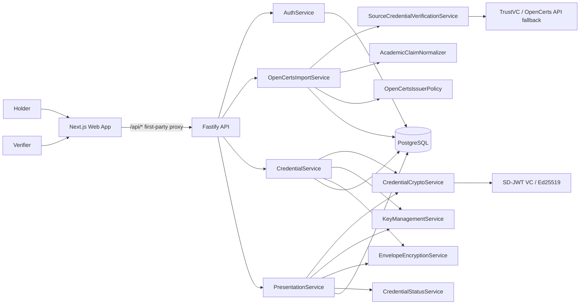

# RevealID

[](https://github.com/SomneelSaha2042/RevealID/actions/workflows/ci.yml)


RevealID is a privacy-preserving academic credential wallet, verifier, and OpenCerts bridge. It lets a holder turn an existing OpenCerts `.opencert` file into a RevealID-derived SD-JWT credential, then share only selected claims through an expiring, holder-bound verification link.

The important distinction: RevealID does not replace OpenCerts or the original issuer. It verifies a user-provided source credential, derives a selective-disclosure proof, and clearly labels that proof as RevealID-derived.

## Current Status

RevealID already has the core SD-JWT wallet and verifier infrastructure:

- Cookie-backed auth with holder/issuer roles.
- Ed25519 SD-JWT credential issuance.
- Mandatory holder key binding for public presentations.
- Encrypted credential and presentation storage.
- Opaque share links backed by SHA-256 token hashes.
- Expiry, cancellation, max-view controls, revocation checks, OpenAPI docs, CI gates, and API tests.

The OpenCerts bridge is being added in phases:

| Phase | Status | What it proves |
| --- | --- | --- |
| 0. Baseline lock | Complete | Existing RevealID gates pass before bridge work |
| 1. Import boundary | Complete | Authenticated holder import route, import persistence, safe metadata-only response |
| 2. Verification and normalization | Complete | TrustVC-backed source verification, OpenCerts fixture, issuer policy, normalized safe preview |
| 3. Derived credential issuance | Complete | Verified imports become RevealID-derived SD-JWT wallet credentials |
| 4. Wallet/share/verifier UX | Complete | End-to-end import, derive, share, and verify UI |
| 5. Hardening and demo | In progress | Redaction checks, duplicate-derive protection, deployment smoke, production-ready narrative |

## Product Idea

OpenCerts proves authenticity and tamper resistance for academic documents, but the verifier usually sees the whole file. RevealID adds a privacy layer on top:

```text
OpenCerts source file
  -> local TrustVC verification
  -> normalized academic claims
  -> RevealID-derived SD-JWT credential
  -> holder-selected disclosure
  -> public verifier sees disclosed claims only
```

For the student-led MVP, the source fixture is the public OpenCerts `sepolia.opencert` sample in `samples/opencerts/sepolia.opencert`. Institution-only acceptance remains disabled until there is an approved institutional `.opencert` and a concrete issuer allowlist.

## What It Does

- Verifies OpenCerts/OpenAttestation-style source documents behind `SourceCredentialVerificationService`.
- Normalizes salted OpenAttestation values into a safe academic claim preview.
- Enforces issuer policy modes: `DEMO` and `INSTITUTION_ONLY`.
- Keeps transcript rows, grades, NRIC-like identifiers, student ID, and transcript ID hidden by default.
- Derives verified imports into encrypted RevealID SD-JWT wallet credentials with source provenance.
- Creates holder-bound public presentations with audience, nonce, expiry, and max-view policy.
- Returns only disclosed claims to verifiers.

## What It Does Not Claim

- RevealID is not an official institutional issuer.
- RevealID does not imply original-institution endorsement.
- RevealID does not replace the original OpenCerts verifier.
- RevealID does not support Verifiable PDF import in the MVP.
- RevealID does not provide zero-knowledge threshold proofs.
- RevealID does not trust arbitrary JSON without source verification.

## Architecture



Routes do not call TrustVC, OpenCerts API clients, JOSE, or SD-JWT libraries directly. Source import, credential issuance, presentation creation, verification, key handling, envelope encryption, and revocation checks stay behind dedicated services.

Detailed docs:

- [Architecture](docs/architecture.md)
- [Protocol notes](docs/protocol.md)
- [Threat model](docs/threat-model.md)
- [API documentation](docs/api.md)
- [Railway deployment](docs/deployment-railway.md)
- [Repository audit checklist](docs/repository-audit.md)
- [ADR-001: SD-JWT selective disclosure](docs/decisions/ADR-001-sd-jwt-rfc9901.md)

## Security Properties

RevealID's central invariant is simple: verification responses expose disclosed claims only.

- Full credentials are never returned to the frontend.
- Full source `.opencert` documents are not returned after import.
- Encrypted credential and presentation blobs remain server-side.
- Raw share tokens are never stored in the database.
- Public verification requires holder key binding, expected audience, expected nonce, expiry checks, view-limit checks, and revocation checks.
- Access and refresh tokens use HTTP-only cookies, not browser `localStorage`.
- Issuer-only operations enforce the `ISSUER` role.
- Holder import, derive, and share operations enforce authenticated ownership.
- Verification audit records store result metadata and hashed request metadata, not claims, emails, raw tokens, credentials, source documents, or presentations.

## Tech Stack

| Layer | Tools |
| --- | --- |
| Web | Next.js 16, React 19, TypeScript, custom responsive CSS |
| API | Fastify 5, Zod, Swagger UI |
| OpenCerts verification | `@trustvc/trustvc`, `ethers@5` |
| Crypto | `@sd-jwt/core`, `@sd-jwt/sd-jwt-vc`, `@sd-jwt/crypto-nodejs`, `jose` |
| Data | PostgreSQL, Prisma |
| Tests | Vitest, Playwright |
| Infra | Docker, Docker Compose, Railway, GitHub Actions |

## Local Development

Prerequisites:

- Node.js 22
- pnpm 9.12.0 through Corepack
- Docker Desktop or PostgreSQL 16

Start the local stack:

```bash
cp .env.example .env
docker compose up -d postgres
corepack pnpm install
corepack pnpm db:generate
corepack pnpm db:migrate
corepack pnpm db:seed
corepack pnpm dev
```

Open:

- Web app: `http://localhost:3000`
- API health: `http://localhost:4000/health`
- Swagger/OpenAPI: `http://localhost:4000/docs`

Seeded evaluator accounts:

| Role | Email | Password |
| --- | --- | --- |
| Issuer | `issuer@demo-university.edu` | `DemoIssuerPass123!` |
| Holder | `holder@example.edu` | `DemoHolderPass123!` |

## API Surface

Swagger UI is available at `/docs`. Browser calls go through the web app's first-party `/api/*` proxy; the API service itself exposes the underlying Fastify routes.

| Area | Endpoint | Purpose |
| --- | --- | --- |
| Auth | `POST /auth/register` | Register a holder account |
| Auth | `POST /auth/login` | Start a cookie-backed session |
| Auth | `GET /me` | Read the current authenticated user |
| Imports | `POST /imports/opencerts` | Verify and normalize an OpenCerts source document |
| Imports | `POST /imports/opencerts/:importId/derive` | Derive a wallet credential from a verified import |
| Issuer | `POST /credentials/issue` | Existing demo issuer SD-JWT credential flow |
| Issuer | `GET /issuer/credentials` | List issuer-owned credential metadata |
| Issuer | `POST /credentials/:id/revoke` | Revoke a credential |
| Wallet | `GET /wallet/credentials` | List holder-owned credentials |
| Wallet | `GET /wallet/credentials/:id` | Read holder credential detail for sharing |
| Shares | `POST /credentials/share` | Create a holder-bound selective disclosure link |
| Shares | `GET /shares` | List holder share history |
| Shares | `DELETE /shares/:id` | Cancel a share |
| Verify | `POST /credentials/verify` | Verify a public share token |
| Metadata | `GET /.well-known/jwks.json` | Publish issuer verification keys |
| Metadata | `GET /issuer/metadata` | Publish issuer metadata |

## Testing

Run the standard gate:

```bash
corepack pnpm lint
corepack pnpm typecheck
corepack pnpm test
corepack pnpm build
```

Run browser e2e tests:

```bash
corepack pnpm test:e2e
```

The test suite covers:

- Signed credential issuance and verification.
- Selective disclosure of only holder-selected fields.
- Serialized presentations and verifier responses excluding hidden CGPA and marks.
- Tampered values, wrong audience, wrong nonce, missing holder binding, expired shares, revoked credentials, and rate limits.
- OpenCerts import auth, CSRF, holder-only access, malformed upload rejection, source verification failure, issuer-policy rejection, and safe normalized previews.
- Browser happy path, privacy path, and revoked-credential failure path across desktop and mobile Chromium.

## Repository Layout

```text
apps/
  api/          Fastify API, Prisma schema, auth, routes, imports, credential services
  web/          Next.js issuer, holder, import, sharing, and verifier UI
packages/
  contracts/    Shared Zod request and response schemas
  crypto/       SD-JWT issuance, presentation, and verification service
samples/
  opencerts/    Public OpenCerts fixture for import tests
docs/
  decisions/    Architecture decision records
  *.md          Architecture, protocol, threat model, API, deployment, audit docs
tests/
  e2e/          Playwright full-stack browser tests
```

## Deployment

RevealID is deployed on Railway as separate web, API, and PostgreSQL services. The repository includes production Dockerfiles for both app services:

- [apps/api/Dockerfile](apps/api/Dockerfile)
- [apps/web/Dockerfile](apps/web/Dockerfile)

Production requires real values for auth token secrets, the credential encryption key, and the issuer private JWK. `.env.example` is intentionally local/demo-safe.

Before production smoke testing, confirm the API service has run:

```bash
corepack pnpm --filter @revealid/api prisma:migrate
corepack pnpm --filter @revealid/api db:seed
```

The seed creates the demo issuer required for derived credential issuance. Do not use the seeded passwords for a real public deployment.

OpenCerts production validation becomes meaningful in stages:

- Phase 3: verify, normalize, and derive wallet credentials from source imports.
- Phase 4: complete import, derive, share, and verify product flow in the UI.
- Phase 5: public demo and external-review readiness.

## Production Smoke Test

Use the public sample in `samples/opencerts/sepolia.opencert` for MVP validation. Keep `OPENCERTS_VERIFICATION_MODE=LOCAL_TRUSTVC`, `OPENCERTS_ISSUER_POLICY_MODE=DEMO`, and `OPENCERTS_RETAIN_SOURCE=false` unless you are explicitly testing the external API fallback.

Critical workflows:

1. Health and docs
   - API `/health` returns `{"status":"ok"}`.
   - API `/docs` loads without auth.
   - Web app loads the home page and the `/wallet/import` route.

2. Auth and role boundaries
   - Register a new holder account.
   - Log out and log back in.
   - Confirm a holder cannot access issuer-only issuance routes.
   - Confirm an unauthenticated import request is rejected.

3. OpenCerts import and derive
   - Sign in as a holder.
   - Upload `samples/opencerts/sepolia.opencert` on `/wallet/import`.
   - Confirm the UI shows verified source metadata, normalized preview claims, hidden-by-default fields, and the RevealID-derived disclaimer.
   - Click derive once and confirm a wallet credential is created.
   - Click derive again or refresh/retry and confirm no duplicate credential is minted.

4. Wallet privacy
   - Open the derived credential in the wallet.
   - Confirm source provenance and disclaimer are visible to the holder.
   - Confirm hidden fields such as transcript rows, grades, student ID, transcript ID, and raw source document content are not displayed as shareable public claims.

5. Selective sharing
   - Share only `recipientName`, `institution`, `credentialName`, and optionally `course`.
   - Open the verification link in a private/incognito browser.
   - Confirm the verifier sees only selected claims, plus the derived-proof disclaimer and source provenance.
   - Confirm undisclosed values do not appear in the verifier response or page source.

6. Negative and security checks
   - Try a malformed JSON upload and confirm a controlled rejection.
   - Try a tampered copy of the sample and confirm verification fails before derivation.
   - Create a max-view `1` share, verify it once, then confirm the second verification fails.
   - Cancel a share and confirm verification fails.
   - Confirm browser storage does not contain access or refresh tokens.
   - Review API logs and confirm there are no raw share tokens, full credentials, full presentations, passwords, private keys, or full source documents.

Known local validation gap: `corepack pnpm test:e2e` may require a working local PostgreSQL/Prisma engine setup. The Vitest integration suite covers the import, derive, share, verification, privacy, tampering, revocation, and duplicate-derive paths; run Playwright in the deployed environment or a fully provisioned local stack before treating the deployment as production-ready.

## Product Feasibility

Yes, RevealID can realistically build the MVP it is aiming for, with one important boundary: it can be a derived proof system, not an official institutional issuer.

The feasible product is:

> A holder uploads an existing OpenCerts credential, RevealID verifies it, derives a privacy-preserving SD-JWT credential, and lets the holder disclose only selected fields to a verifier.

The infeasible or dishonest product, without institutional cooperation, is:

> RevealID issues official institutional selective-disclosure credentials or claims original-institution endorsement.

That boundary is not a weakness. It is the product's credibility line.

## Portfolio Summary

RevealID demonstrates privacy-preserving credential sharing with production-minded engineering boundaries: OpenCerts source verification, real SD-JWT selective disclosure, service-isolated cryptography, encrypted storage, revocation, OpenAPI docs, CI gates, full-stack UI, and browser e2e coverage.

Resume-ready version:

> Built RevealID, a full-stack TypeScript academic credential wallet and OpenCerts bridge using TrustVC source verification, SD-JWT selective disclosure, Ed25519 holder binding, encrypted credential storage, revocation checks, and privacy tests to ensure verifiers only receive explicitly disclosed claims.
