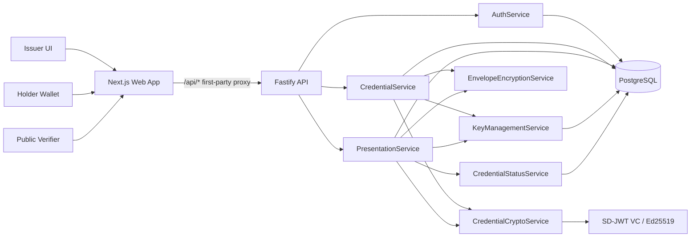

# RevealID

[](https://github.com/SomneelSaha2042/RevealID/actions/workflows/ci.yml)


RevealID is a privacy-preserving academic credential wallet and verifier. It demonstrates how a credential holder can share only selected claims, such as degree and graduation year, while keeping sensitive claims such as CGPA and marks hidden from the verifier.

The core implementation uses SD-JWT selective disclosure with Ed25519 issuer signatures and mandatory holder key binding for public presentations. It is intentionally built as an evaluator-friendly portfolio project: full-stack UI, production deployment, OpenAPI docs, threat model, Docker support, CI gates, and browser e2e tests.

## Live Deployment

| Service | URL |
| --- | --- |
| Web app | [https://revealidweb-production.up.railway.app/](https://revealidweb-production.up.railway.app/) |
| API | [https://revealidapi-production.up.railway.app/](https://revealidapi-production.up.railway.app/) |
| Swagger/OpenAPI | [https://revealidapi-production.up.railway.app/docs](https://revealidapi-production.up.railway.app/docs) |
| API health | [https://revealidapi-production.up.railway.app/health](https://revealidapi-production.up.railway.app/health) |

Latest production smoke check: May 30, 2026. Web root, API health, web `/api/health` proxy, and Swagger UI returned `200 OK`.

## What It Does

- Issuer signs academic credentials using Ed25519-backed SD-JWT VC issuance.
- Holder stores credentials in an encrypted wallet and chooses which claims to disclose.
- RevealID creates holder-bound verifiable presentations with audience, nonce, expiry, and max-view policy.
- Verifier opens a public link or QR payload and receives only disclosed claims.
- Issuers can revoke credentials; revoked credentials fail future verification.
- Share links are backed by opaque tokens. The database stores SHA-256 token hashes only.

## Architecture



Routes do not call cryptographic libraries directly. Credential issuance, presentation creation, verification, key handling, envelope encryption, and revocation checks stay behind dedicated services.

Detailed docs:

- [Architecture](docs/architecture.md)
- [Protocol notes](docs/protocol.md)
- [Threat model](docs/threat-model.md)
- [API documentation](docs/api.md)
- [Railway deployment](docs/deployment-railway.md)
- [Repository audit checklist](docs/repository-audit.md)
- [ADR-001: SD-JWT selective disclosure](docs/decisions/ADR-001-sd-jwt-rfc9901.md)

## Security Properties

RevealID's central invariant is simple: verification responses expose disclosed claims only.

- Full credentials are never returned to the frontend.
- Encrypted credential and presentation blobs remain server-side.
- Raw share tokens are never stored in the database.
- Public verification requires holder key binding, expected audience, expected nonce, expiry checks, view-limit checks, and revocation checks.
- Access and refresh tokens use HTTP-only cookies, not browser `localStorage`.
- Issuer-only operations enforce the `ISSUER` role.
- Verification audit records store result metadata and hashed request metadata, not claims, emails, raw tokens, credentials, or presentations.

## Tech Stack

| Layer | Tools |
| --- | --- |
| Web | Next.js 16, React 19, TypeScript, custom responsive CSS |
| API | Fastify 5, Zod, Swagger UI |
| Crypto | `@sd-jwt/core`, `@sd-jwt/sd-jwt-vc`, `@sd-jwt/crypto-nodejs`, `jose` |
| Data | PostgreSQL, Prisma |
| Tests | Vitest, Playwright |
| Infra | Docker, Docker Compose, Railway, GitHub Actions |

## Local Development

Prerequisites:

- Node.js 22
- pnpm 9.12.0 through Corepack
- Docker Desktop or PostgreSQL 16

Start the local stack:

```bash
cp .env.example .env
docker compose up -d postgres
pnpm install
pnpm db:generate
pnpm db:migrate
pnpm db:seed
pnpm dev
```

Open:

- Web app: `http://localhost:3000`
- API health: `http://localhost:4000/health`
- Swagger/OpenAPI: `http://localhost:4000/docs`

Seeded evaluator accounts:

| Role | Email | Password |
| --- | --- | --- |
| Issuer | `issuer@demo-university.edu` | `DemoIssuerPass123!` |
| Holder | `holder@example.edu` | `DemoHolderPass123!` |

## API Surface

Swagger UI is available at `/docs`. Browser calls go through the web app's first-party `/api/*` proxy; the API service itself exposes the underlying Fastify routes.

| Area | Endpoint | Purpose |
| --- | --- | --- |
| Auth | `POST /auth/register` | Register a holder account |
| Auth | `POST /auth/login` | Start a cookie-backed session |
| Auth | `GET /me` | Read the current authenticated user |
| Issuer | `POST /credentials/issue` | Issue an SD-JWT academic credential |
| Issuer | `GET /issuer/credentials` | List issuer-owned credential metadata |
| Issuer | `POST /credentials/:id/revoke` | Revoke an issued credential |
| Wallet | `GET /wallet/credentials` | List holder-owned credentials |
| Wallet | `GET /wallet/credentials/:id` | Read holder credential detail for sharing |
| Shares | `POST /credentials/share` | Create a holder-bound selective disclosure link |
| Shares | `GET /shares` | List holder share history |
| Shares | `DELETE /shares/:id` | Cancel a share |
| Verify | `POST /credentials/verify` | Verify a public share token |
| Metadata | `GET /.well-known/jwks.json` | Publish issuer verification keys |
| Metadata | `GET /issuer/metadata` | Publish issuer metadata |

## Testing

Run the standard gate:

```bash
pnpm verify
```

Run browser e2e tests:

```bash
pnpm test:e2e
```

The test suite covers:

- Signed credential issuance and verification.
- Selective disclosure of only holder-selected fields.
- Serialized presentations and verifier responses excluding hidden CGPA and marks.
- Tampered values, wrong audience, wrong nonce, missing holder binding, expired shares, revoked credentials, and rate limits.
- Browser happy path, privacy path, and revoked-credential failure path across desktop and mobile Chromium.

## Repository Layout

```text
apps/
  api/          Fastify API, Prisma schema, auth, routes, credential services
  web/          Next.js issuer, holder, sharing, and verifier UI
packages/
  contracts/    Shared Zod request and response schemas
  crypto/       SD-JWT issuance, presentation, and verification service
docs/
  decisions/    Architecture decision records
  *.md          Architecture, protocol, threat model, API, deployment, audit docs
tests/
  e2e/          Playwright full-stack browser tests
```

## Deployment

RevealID is deployed on Railway as separate web, API, and PostgreSQL services. The repository includes production Dockerfiles for both app services:

- [apps/api/Dockerfile](apps/api/Dockerfile)
- [apps/web/Dockerfile](apps/web/Dockerfile)

Production requires real values for auth token secrets, the credential encryption key, and the issuer private JWK. `.env.example` is intentionally local/demo-safe.

## Portfolio Summary

RevealID demonstrates privacy-preserving credential sharing with production-minded engineering boundaries: real selective disclosure, service-isolated cryptography, encrypted storage, revocation, OpenAPI docs, CI gates, full-stack UI, and browser e2e coverage.

Resume-ready version:

> Built RevealID, a full-stack TypeScript academic credential wallet using SD-JWT selective disclosure, Ed25519 holder binding, encrypted credential storage, revocation checks, and Playwright privacy tests to ensure verifiers only receive explicitly disclosed claims.
