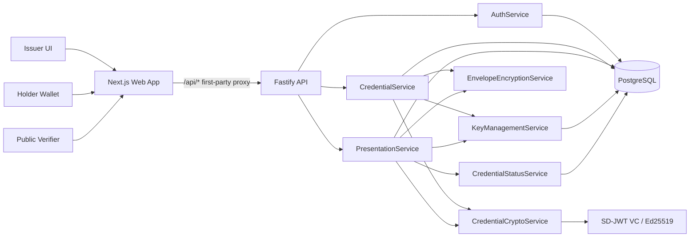

# RevealID Architecture

RevealID is a two-service TypeScript application with shared contracts and an isolated cryptographic package. The core invariant is that a verifier only receives claims the holder explicitly disclosed.

## System Diagram

## Packages

| Package | Responsibility |
| --- | --- |
| `apps/web` | Next.js UI for issuer issuance, holder wallet, selective sharing, share history, and public verification. |
| `apps/api` | Fastify API, auth, Prisma persistence, Swagger/OpenAPI, credential services, share verification, and revocation. |
| `packages/contracts` | Shared request and response schemas used by API routes and callers. |
| `packages/crypto` | SD-JWT issuance, presentation creation, holder binding, and verification. |

## Trust Boundaries

- Browser clients never receive encrypted credential blobs, full SD-JWT credentials, private keys, or raw database tokens.
- Route handlers call services, not crypto libraries.
- Credential cryptography is isolated in `CredentialCryptoService`.
- Presentation creation and verification are coordinated by `PresentationService`.
- Private key generation and encrypted private-key reads go through `KeyManagementService`.
- Credential and presentation ciphertext are protected by `EnvelopeEncryptionService`.

## Data Flow

1. Issuer signs in and issues an academic credential to a holder email.
2. The API creates or reuses the holder key, signs the SD-JWT credential, and stores only an encrypted credential envelope.
3. Holder signs in, views credential metadata, and chooses which claims to disclose.
4. The API creates a holder-bound SD-JWT presentation with audience, nonce, expiry, max views, and an opaque share token.
5. The database stores the encrypted presentation and SHA-256 token hash only.
6. Public verifier submits the token.
7. The API hashes the token, loads the encrypted presentation, checks expiry, view limits, revocation, issuer signature, disclosure digests, holder key binding, audience, and nonce.
8. The response returns only disclosed claims and privacy-safe verification checks.

## Local and Production Topology

Local development uses Docker Compose for PostgreSQL and two Node processes for the API and web app. Production deployment uses separate Docker-backed services for `apps/api` and `apps/web`, plus managed PostgreSQL. The web app proxies `/api/*` to the API so browser auth cookies stay first-party.
